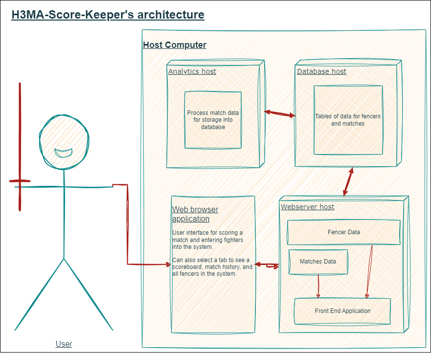

# H3MA-Score-Keeper
An application designed to score and track HEMA fights and statistics using 3 virtual machines.

Project made to satisfy an assignment at the University of Otago - COSC349 Cloud Computing Architecture paper.
<p align="center">
    
</p>
HEMA (Historical European Martial Arts) is a thrilling sport with competitors, clubs and collections of enthusiasts all across the world. Practitioners of the sport most often face off in one-on-one duels, wielding various historical weapons such as the longsword, rapier or sabre.

H3MA-Score-Keeper (the '3' representing the use of three virtual machines) aims to provide management and scoring of fights in an easy and secure way. 

If you use this for in any way (scoring official tournaments or casual sparring within a club), let me know how I can improve the software by submitting an issue or feature request!

<hr>

## Prerequisites:
In order to run this application you must install Vagrant and Virtual box to provision and run the virtual machines's that power the application.

## How to run the application:
To get started, open VirtualBox and the command prompt, or other terminal.
If VirtualBox is not open, provisioning the VMs will often timout, and the application may not launch correctly.

1. Download or clone the repository:
```
git clone https://github.com/Akira-bug/H3MA-Score-Keeper.git
```

2. In your terminal, navigate to the directory of the repository:
```
cd your/path/to/H3MA-Score-Keeper
```

3. Run the vagrant command.
```
vagrant up
```

4. Open your web browser and in the url bar, paste the following link:
```
192.168.56.11:3000
```

<hr>

## Update the scores and scoreboard, get fencer analysis:
I have yet to implment a functional method for getting this script to automatically run on the associated VM, as such you can run it manually by:

Access the "analyser" virtual machine:
```
vagrant ssh analyser
```

You can:

1. Get the analysis on a single fencer, run this command:
```
python3 /vagrant/analysis/analysis.py
```
- Enter the name when prompted to view the stats of that fighter.

and/or...

2. Update the scoreboard and view analaysis on all fencers, run the following command:
```
python3 /vagrant/analysis/analyseAll.py
```
- The script should run and print all the stats!

Once finished, you can type `logout` to end the ssh connection.

<hr>

## How to shut down the application:
Ensure you have exported the database if you plan on using the stats you have collected.
You can do this simply by navigating to the "View Matches" page, then clicking the "Backup data" button.
1. Exit the vagrant process using `ctrl + c`.  
2. Connect to the react-app VM.
```
vagrant ssh react-app
```
3. Shut down all Node processes.
```
sudo killall node
```
4. Logout of the vm using `logout`.
5. Use `vagrant destroy` and agree to destroy the VMs.

You must use these steps or manually end the processes using something like task manager and ending any Ruby or Vagrant processes.
This is becuase the Node server and React application are started as background processes, that don't end when using `ctrl + c` from the host shell running vagrant.

<hr>

#### Diagram of application's architecture.

<p align="center">
    
</p>
<hr>

### AWS Deployment
I have deployed a public version of the software [here!](http://52.203.255.115:3000/matchtracker).
An account system and login page are currently a work in progress, so everyone accessing the site shares the same database, and as such, the same scoreboard, fencers, matches etc.

H3MA-Score-Keeper can be deployed to the AWS cloud manually by loosely following these steps:
*Note: This guide just serves as a general outline on how I achieved my manual deployment. I am definitely missing some intricate details somewhere...*

1. Create an AWS account, login, launch two EC2 instances. 

   - From the console, navigate to EC2 and launch an instance that will host the front-end React application and Node.js server. Launch one additional EC2 instance that hosts the analysis functionality.

   - During the set up of the two EC2 instances, make sure they are part of the same VPC and security group. Once created, use your terminal to SSH and connect to the front-end host EC2 instance.
   - Next, you'll need to install all of the requisite dependencies of the application by following the commands used in the `react-app-provision.sh` script in the main branch. The main ones are as follows: nodejs, npm, mysql-client, git.

   - Finally, SSH into the analysis EC2 instance and install the requisite dependencies of the python scripts in the analysis folder by following the `analyser-provision.sh` provisioning script. These main ones are: Python3, pip, mysql-client. Using pip, install mysql-connector-python.

3. Create a mysql database using RDS.

   - Create a database that runs on MySQL and connect it to the front-end app EC2 instance you just created. Once it's available, take note of the database's endpoint and port, and credentials.
   - Ensure that the front-end EC2 instance is also part of the same security group as the database.
   - From the fornt-end EC2 instance, use mysql to set up the database and tables. 

5. Clone or fork the 'deploy' branch of this repository and update the files into the EC2 instances.

   - Because we are manually deploying the application on the cloud, we don't need most of the files.
   - Using the cloned deploy repo files, publish a new private repository on GitHub and modify the host address to the database endpoint, as well as fill in any credentials. I recommend using the "search" and "replace" functionality in most IDEs.
   - Update the python scripts in a similar way, but from within the analysis instance.
   - Update the .jsx files in the client/src/pages by changing the existing http address to the public IPv4 address of the front-end EC2 instance.
   - Inside of both EC2 instances, create a new directory that will host the project's files. Use Git to clone your custom repo into the project directory of the EC2 instances.
   - Using npm, install pm2 and serve globally on the front-end EC2.
   
6. Install the Node modules on the front-end EC2.
   
   - Navigate to the backend directory in the project files and run `npm install` to download and install the dependencies. Now, use pm2 to run the Node.js server as a background process like so:
   ```
   sudo pm2 node index.js
   ```
   - Next, navigate to the client directory in the project files and run `npm install` then `npm build`. Run `sudo pm2 serve build 3000`.
   - Finally, run `pm2 startup` and `pm2 save` to save the configuration and have the application run whenever the instance starts up again.
   - To access the web application, use the public IPv4 address and append the port that the front end is hosted on, 3000.
     
7. Should be good!
   - At this point, I recommend securing an static public IPv4 address using an Elastic IP for your front-end application instance, as this saves you from having to adjust the addresses all files whenever the instance restarts or updates.
   - I also set up an S3 bucket to store backups of the repository files. One could also look into using the Amplify service to host the application.
   - Although this set up is relatively lightweight, be sure to keep an eye on your accounts and set up cost management to avoid incurring high fees.
   
<hr>

Initial set up of this project follows the development process from the COSC349 [vagrant-multivm](https://altitude.otago.ac.nz/cosc349/vagrant-multivm) repository on GitLab by David Eyers.
ChatGPT-3.5 used to make parts of this project.
