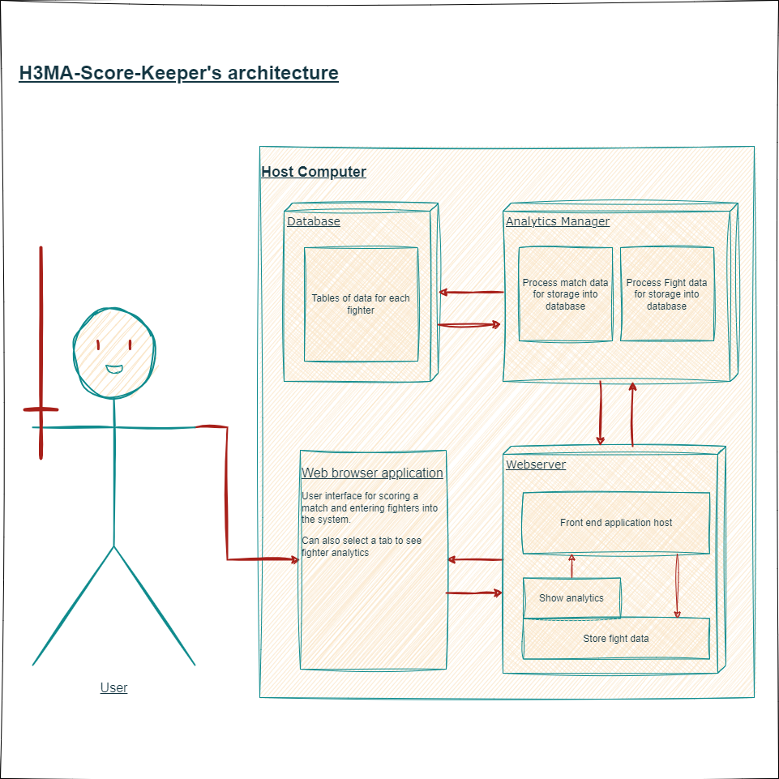

# H3MA-Score-Keeper
An application to score and track HEMA fights and statistics using 3 virtual machines.
Assignment at the University of Otago - COSC349 Cloud Computing - Assignment 1.

HEMA (Historical European Martial Arts) is a thrilling sport with competitors, clubs and collections of enthusiasts all across the world. Practitioners of the sport most often face off in one-on-one duels, wielding various historical weapons such as the longsword, rapier or sabre. 

H3MA-Score-Keeper (the '3' representing the use of three virtual machines) aims to provide management and scoring of fighter analytics in an easy and secure way. 

Use in scoring official tournaments or casual sparring within a club!

Diagram of the architecture of the application.

